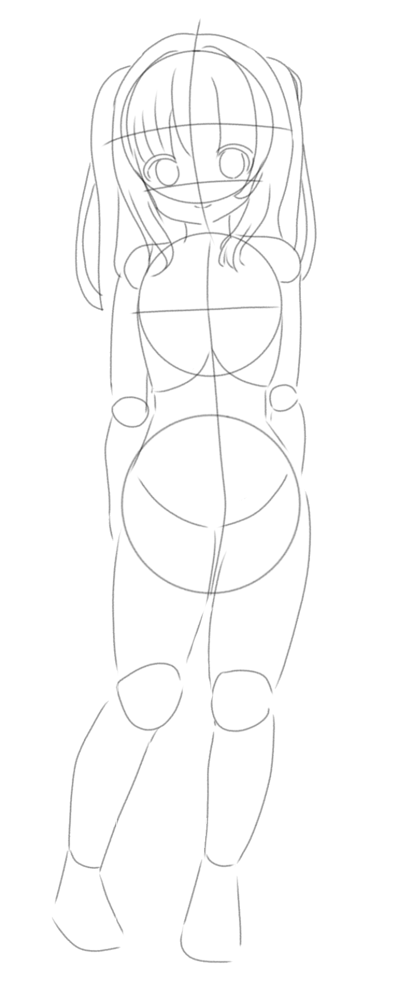

# vmsgk

vmsgk (Virtual Mesugaki) is a personal AI companion project built using Python, Flask, and Ollama.

The goal of the project is to explore how a conversational AI can maintain personality consistency, contextual memory, and long-term interaction while running locally. Rather than functioning as a generic chatbot, vmsgk is designed as a character-driven companion with persistent behavior and memory systems.

## Features

- Character-based conversational AI
- Persistent memory system
- Personality-driven responses
- Local LLM integration through Ollama
- Web-based chat interface using Flask
- Ongoing development of long-term memory and interaction systems

## Technologies

- Python
- Flask
- HTML/CSS
- Ollama
- Prompt Engineering
- JSON-based memory storage

## Current Status

🚧 Work in Progress

The project is currently under active development. Future improvements include enhanced memory retrieval, improved conversational consistency, and expanded interaction features.

## Project Goal

This project serves as an exploration of AI-driven user experiences, focusing on the intersection of personality design, memory systems, and human-computer interaction.

## Character

Below is the current full-body sprite used for vmsgk:

  

